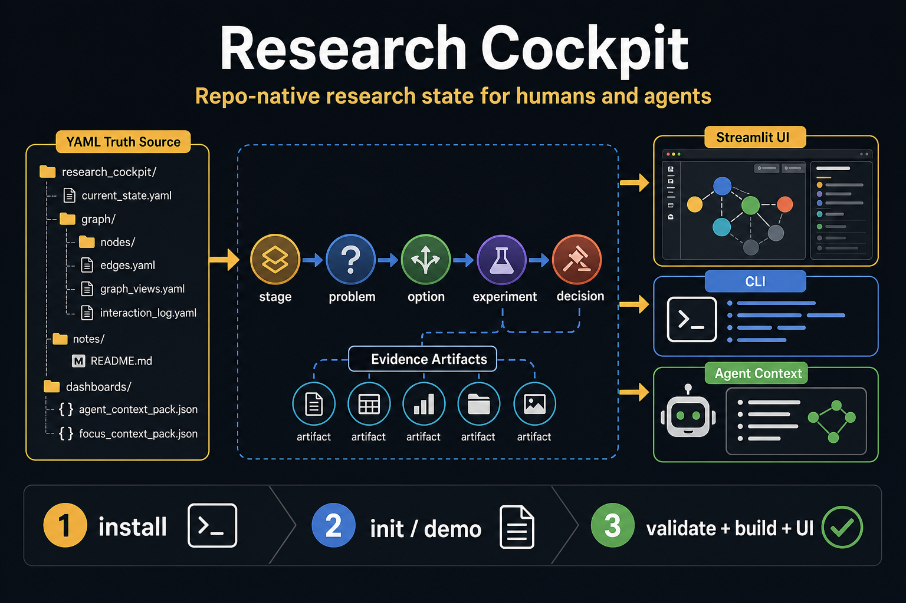
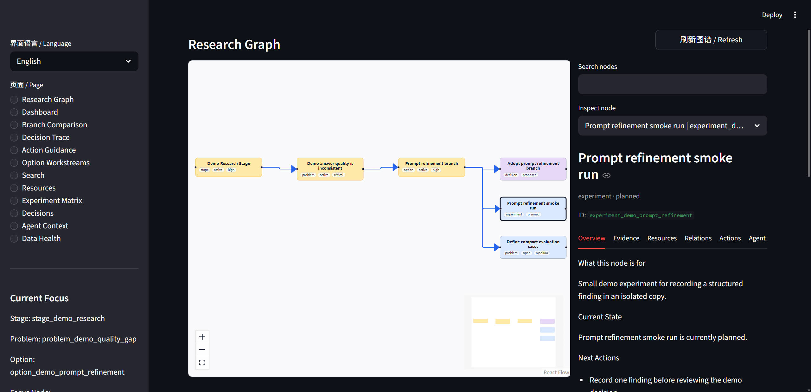

# Research Cockpit



一张速览图：Research Cockpit 将 YAML/Markdown truth source、CLI、Streamlit UI 和 Agent Context 串成同一条研究状态工作流。

Research Cockpit 是一个 repo-native 的研究状态管理工具。它把研究问题、方案、实验、证据和决策记录在仓库里的 YAML/Markdown 文件中，并提供 CLI、Streamlit UI 和 agent 友好的上下文接口。

它适合这些场景：

- 你在一个代码仓库里同时推进多个 research problem、方案分支和实验。
- 你需要让人类和 coding agent 共享同一份研究状态，而不是依赖聊天记录或散落的笔记。
- 你想快速看到“当前焦点是什么、有哪些备选方案、实验证据在哪里、下一步该做什么”。

核心图谱模型是：

```text
stage -> problem -> option -> experiment -> decision
```

`artifact` 也是合法节点类型，但默认作为支持证据使用，例如结果目录、指标 JSON、review bundle、报告或其它需要独立追踪的研究产物。



## 5 分钟跑通 Demo

前置条件：

- Python 3.10+
- 在本仓库根目录执行命令

安装本地开发包：

```sh
python -m pip install -e .
```

验证内置 demo 数据：

```sh
research-cockpit validate --root examples/demo_research_cockpit --json
research-cockpit build --root examples/demo_research_cockpit
research-cockpit smoke --root examples/demo_research_cockpit --json
```

启动 UI：

```sh
research-cockpit ui --root examples/demo_research_cockpit --server.port 8501
```

打开浏览器访问：

```text
http://localhost:8501
```

如果 `research-cockpit` 命令不可用，但 Python 包可以 import，可以用模块入口：

```sh
python -m research_cockpit.cli validate --root examples/demo_research_cockpit --json
python -m research_cockpit.cli ui --root examples/demo_research_cockpit --server.port 8501
```

## 用自己的仓库开始

这个仓库本身是可复用插件包。真实项目的研究状态应该放在调用方仓库的 `research_cockpit/` 目录里，而不是写进插件目录。

在你的项目仓库根目录运行：

```sh
research-cockpit init --root research_cockpit --build --json
research-cockpit validate --root research_cockpit --json
research-cockpit ui --root research_cockpit --server.port 8501
```

如果你想从更完整的示例状态开始：

```sh
research-cockpit init --template demo --root research_cockpit --build --json
```

推荐日常循环：

```sh
research-cockpit validate --root research_cockpit --json
research-cockpit build --root research_cockpit
research-cockpit ui --root research_cockpit --server.port 8501
```

## 你会得到什么

Research Cockpit 提供三层能力：

| 能力 | 面向谁 | 用来做什么 |
| --- | --- | --- |
| YAML/Markdown 状态文件 | 人类和 agent | 保存研究图谱、节点详情、笔记和证据引用 |
| CLI | 人类和 agent | 初始化、验证、构建 dashboard、更新状态、记录实验证据 |
| Streamlit UI | 人类 | 浏览研究图谱、筛选节点、查看详情、资源、证据和行动建议 |

关键原则：

- `research_cockpit/current_state.yaml` 和 `research_cockpit/graph/nodes/*.yaml` 是 truth source。
- `research_cockpit/dashboards/*` 是生成文件，用 `research-cockpit build --root <root>` 生成。
- 日常修改优先用 CLI 命令，避免直接手改 YAML 后破坏图谱关系。
- 同一个 data root 的写操作要顺序执行，不要并发写。

## UI 怎么用

启动后默认进入 Research Graph 页面。这里可以：

- 用 Focus 深度、当前分支、方案工作流、全局图谱切换视图范围。
- 按 node type、status、stage、focus role、workstream、blocking、missing evidence 筛选节点。
- 点击图谱节点，在右侧查看概览、证据、资源、关系、行动和 agent 上下文。
- 保存常用 graph view，后续一键恢复筛选条件。

图谱默认使用 React Flow 和 Dagre layout。PyVis 是 legacy fallback。后台 agent 或手动命令改了 YAML 后，先运行 `research-cockpit build --root research_cockpit`，再在 UI 中点击 `Refresh`。普通数据变化不需要重建 React bundle。

前端组件开发才需要 Node 依赖：

```sh
cd src/research_cockpit/ui/graph_component/frontend
npm install
npm run build
```

## 常用命令

| 目标 | 命令 |
| --- | --- |
| 初始化最小状态 | `research-cockpit init --root research_cockpit --build --json` |
| 初始化 demo 状态 | `research-cockpit init --template demo --root research_cockpit --build --json` |
| 校验数据 | `research-cockpit validate --root research_cockpit --json` |
| 生成 dashboard/context | `research-cockpit build --root research_cockpit` |
| 启动 UI | `research-cockpit ui --root research_cockpit --server.port 8501` |
| 查看可用命令 | `research-cockpit commands --json --compact` |
| 全局启动上下文 | `research-cockpit bootstrap --root research_cockpit --json` |
| 单节点上下文 | `research-cockpit context --root research_cockpit --id <node_id> --with-bootstrap --with-artifacts --compact --json` |
| 搜索知识 | `research-cockpit search --root research_cockpit --query "keyword" --json` |
| 冒烟测试 | `research-cockpit smoke --root research_cockpit --json` |

## 常见工作流

### 1. 创建一个新研究分支

适合从一个 problem 开始，创建 active option、planned experiments 和 follow-up options：

```sh
research-cockpit create-workstream --print-schema
research-cockpit create-workstream --root research_cockpit --file workstream.yaml --dry-run --json --show-diff
research-cockpit create-workstream --root research_cockpit --file workstream.yaml --no-build
research-cockpit validate --root research_cockpit --json
research-cockpit build --root research_cockpit
```

`create-workstream` 不会自动改变全局 focus、暂停旧方案或删除旧分支。follow-up option 应使用 `open` 状态；文件输入里的 option `planned` 会被规范化为 `open`。

### 2. 记录实验结论和证据

单个实验：

```sh
research-cockpit complete-experiment \
  --root research_cockpit \
  --id experiment_x \
  --finding "..." \
  --confidence medium \
  --evidence-path outputs/run_x \
  --evidence-link metrics=outputs/run_x/metrics.json \
  --json --compact
```

批量实验：

```sh
research-cockpit complete-experiments --print-schema
research-cockpit complete-experiments --root research_cockpit --file findings.yaml --dry-run --json --show-diff
research-cockpit complete-experiments --root research_cockpit --file findings.yaml --no-build
```

inline evidence 只负责用 `path` 和 `links` 快速创建并关联 evidence artifact。复杂 artifact 元数据请先用 `create-artifact` 创建，再通过 `--artifact-id` 关联。

### 3. 显式创建或关联 artifact

```sh
research-cockpit create-artifact --print-schema
research-cockpit create-artifact --root research_cockpit --file artifact.yaml --dry-run --json --show-diff
research-cockpit create-artifact --root research_cockpit --id artifact_x --title "Result bundle" --status done --path outputs/run_x --link metrics=outputs/run_x/metrics.json --link-to experiment_x --no-build
research-cockpit link-artifact --root research_cockpit --artifact artifact_x --to option_x --no-build
```

Artifact 的 `path` 和 `links` 会按原样存储。生成的 resource rows 会包含解析路径、解析基准和文件是否存在等信息。

### 4. 收尾一个方案工作流

只有当 close-out 状态明确时再 finalize：

```sh
research-cockpit finalize-workstream --print-schema
research-cockpit finalize-workstream --root research_cockpit --file finalize.yaml --dry-run --json --show-diff
research-cockpit finalize-workstream --root research_cockpit --file finalize.yaml --json --compact
```

`finalize-workstream` 不会创建 artifact、接受 decision、暂停旧分支、删除节点或编造 next actions。

## 给 Agent 的最短上下文路径

已知节点 id 时，优先用一个命令完成 handoff：

```sh
research-cockpit context --root research_cockpit --id <node_id> --with-bootstrap --with-artifacts --compact --json
```

不知道节点 id、需要全局 triage 时：

```sh
research-cockpit bootstrap --root research_cockpit --json
```

需要完整方案子树、实验摘要和证据计数时：

```sh
research-cockpit option-workstream-context --root research_cockpit --id <option_id> --compact --json
```

选择命令面时用 compact command discovery：

```sh
research-cockpit commands --json --compact --workflow evidence
research-cockpit commands --json --compact --name create-workstream
```

不要在已知节点任务里重复串联 `bootstrap`、生成 context packs 和 `node-context`。直接用 `context` 更短、更稳定。

## 数据结构

项目 data root 结构：

```text
research_cockpit/
  current_state.yaml
  graph/nodes/
  graph/edges.yaml
  graph/graph_views.yaml
  graph/interaction_log.yaml
  notes/
  dashboards/               # build 生成
```

节点状态按类型校验：

| Node type | Valid statuses |
| --- | --- |
| `stage` | `planned`, `active`, `blocked`, `done` |
| `problem` | `open`, `active`, `blocked`, `resolved`, `parked` |
| `option` | `open`, `active`, `promising`, `rejected`, `accepted`, `paused`, `parked` |
| `experiment` | `planned`, `queued`, `running`, `done`, `failed`, `cancelled` |
| `decision` | `proposed`, `accepted`, `superseded`, `rejected` |
| `artifact` | `draft`, `planned`, `active`, `done`, `superseded`, `deprecated`, `archived` |

注意：

- `promising` 只用于已有正向信号但还没完成比较、实验或 decision gate 的 `option`。
- 不要直接手改 YAML 把 decision 设置为 `accepted`，请用 `research-cockpit accept-decision`。
- 如果 dry-run 或 validate 报告 `interaction_log.yaml` 损坏，先用 `repair-interaction-log` 预览和修复。

## 仓库结构

```text
src/research_cockpit/       # Python runtime, CLI, model, Streamlit UI
capabilities/               # Agent-facing workflow docs
templates/                  # data-root templates
examples/demo_research_cockpit/
schemas/
docs/
tests/
SKILL.md
```

推荐阅读：

- `docs/repo-layout.md`: 仓库布局和模块地图。
- `docs/internal-architecture.md`: 内部模块边界和依赖规则。
- `docs/decisions/0001-layered-plugin-architecture.md`: layered plugin architecture rationale。
- `capabilities/ui-dashboard.md`: Streamlit UI、React Flow 图谱和刷新行为。
- `capabilities/graph-state.md`: 图谱状态、saved views 和 interaction log。
- `capabilities/experiment-tracking.md`: experiment、finding、artifact 和 workstream 流程。
- `capabilities/node-management.md`: 节点创建、批量图谱计划和 lifecycle cleanup。

## 并行 Agent 和 Worktree

并行 agent 可以用 git worktrees 隔离代码和实验输出，但 Research Cockpit 状态仍应写入主仓库的 canonical `research_cockpit/` root。

规则：

- Worktree 里做代码改动、运行实验、保存本地输出。
- Canonical root 里写所有 `research-cockpit` 状态变更。
- 不要在 worktree 里重新 `research-cockpit init`。
- 下游 agent 用 `set-agent-focus` 汇报进展，不要随意改全局 `set-focus`。
- 多个写操作顺序执行；可在每个命令加 `--no-build`，最后由主仓库统一 `validate` 和 `build`。

更多细节见 `capabilities/experiment-tracking.md` 和 `capabilities/graph-state.md`。

## 开发者验证

从插件根目录运行：

```sh
python -m unittest discover -s tests
research-cockpit smoke --root examples/demo_research_cockpit --json
python dev/scripts/run_skill_release_check.py --json --skip-mutating
python dev/scripts/run_agent_usability_check.py --json
python dev/scripts/run_subagent_forward_check.py --json
git diff --check
```

如果只改文档，至少运行：

```sh
git diff --check
python dev/scripts/run_skill_release_check.py --json --skip-mutating
```
