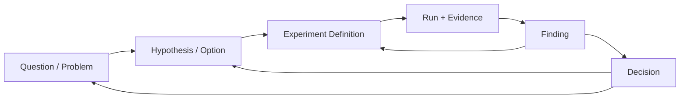
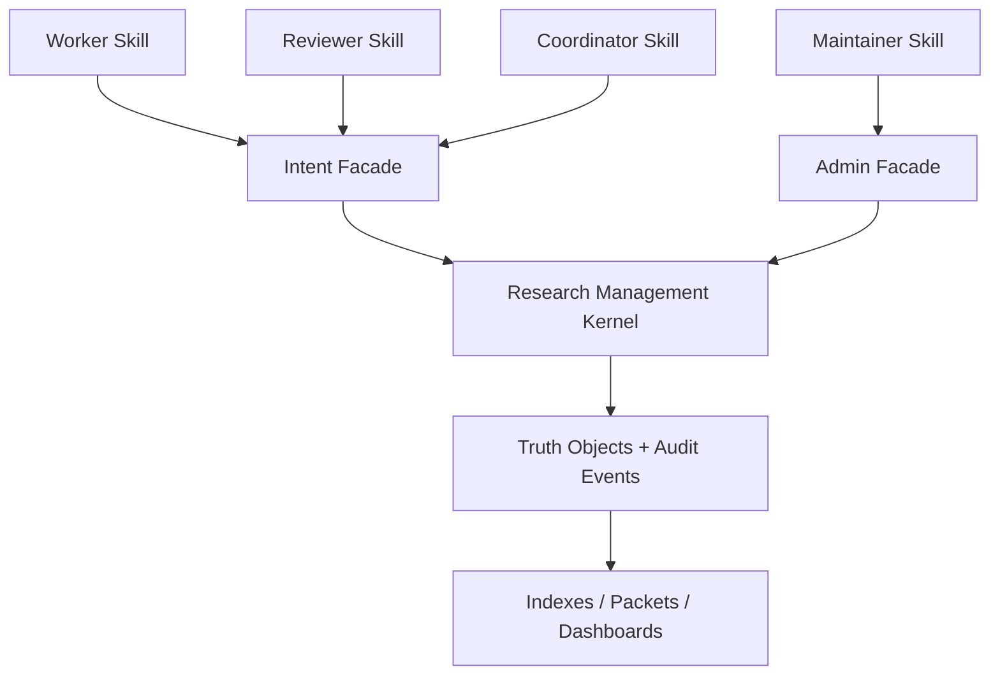
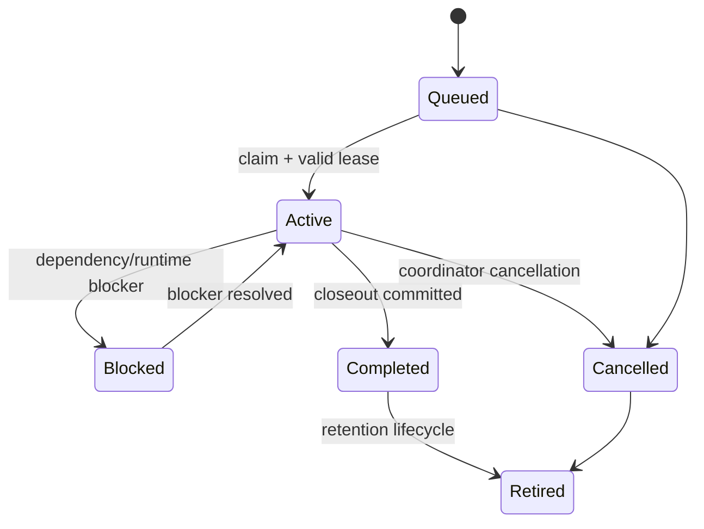

# Spec: Multi-Agent Research Management Framework

## Status

Accepted / Implementing。2026-07-19 已确认目标架构和 review gate；CLI 采用 one-version breaking cutover，legacy structured data 与 artifact 保持读写兼容。

## Accepted Decisions

- canonical worker read name 使用 `work open`；worker、reviewer、coordinator、maintainer 使用各自 role facade。
- 被 role facade 取代的旧 top-level CLI names 不保留 alias、deprecated warning 或 compatibility window；未被取代且仍必要的诊断/维护能力必须归入新的 canonical surface。
- 0.2.x 及更早已保存的 nodes、agents、assignments、runs、gate results、artifact records/payload manifests 和 interaction history 必须可直接读取和继续写入；未知 legacy fields 必须 round-trip 保留。
- 数据文件不因一次普通读取或 mutation 被强制整体迁移；显式 migration 必须支持 dry-run、audit 和 rollback guidance。
- Work Packet/assignment 是并发边界；canonical-root global short commit sequencer 首轮保留。
- canonical lease 默认 900 秒，heartbeat cadence 300 秒；mutation 自动续租，长实验由 launcher/runtime 在模型上下文外 heartbeat。
- idempotency receipt 写入同一次 mutation 的 append-only interaction event；validation/operation index 只做可重建 lookup acceleration，不新增 per-operation files。
- `work close` 首轮支持 optional final `evidence_inputs`；stage/hash/copy 在锁外完成，`work record` 只服务 incremental/streaming durability。
- 首轮保持一个 plugin package 和一个 root role router；是否拆为多个发布 skill 需另立 ADR。

## Phase 0 Baseline

| Metric | Before | Evidence boundary |
| --- | ---: | --- |
| Active public commands | 70 | current command manifest/release check |
| Compact summary-only manifest | 39,165 bytes | current release check |
| Root skill | 8,089 bytes / 120 lines | current release check |
| Root skill + experiment-cycle capability | 12,933 bytes | current files |
| Assigned worker, no payload | 3 Research Cockpit invocations | context + create-run + complete-run |
| Assigned worker, final payload | 4 Research Cockpit invocations | context + create-run + ingest-artifact + complete-run |
| Historical warm execution context median | 0.518 s | 5k-node/4k-record local fixture; not CI SLA |
| Historical warm create/close medians | 0.773 s / 0.899 s | same local fixture; not CI SLA |
| 1/4/8/16-agent mutation trace | instrumented | prepare、lock wait、lock hold、commit、index patch 和 conflict rate 分段采集 |

Phase 0 不提交机器特定 benchmark 结果；benchmark JSON 必须包含环境摘要并写入临时目录。文档只记录可复现命令、预算和经 review 接受的结论。

Phase 0 implementation record：

- `public_contracts.py` 冻结五个 v1 examples、role operations、workflow budgets，以及递归字段、strict mutation input 和交叉语义 validator。
- `multi_agent_baseline.py` 从真实 manifest 生成 70-command inventory，并为每项给出 audience、surface、intent、canonical replacement 和 removal disposition。
- mutation `--progress` 现在区分 `targeted_preflight`、`lock_wait`、`lock_hold`、`commit`、`index_update` 和总 transaction。
- workflow baseline 明确区分声明与实测：命令序列、state-load lower bound 和 facade nested-subprocess count 来自静态审计；`run_agent_usability_check.py` 与 `run_skill_release_check.py` 记录实际 stdout/stderr bytes 和 wall time。缺少 instrumentation 的字段返回 `null`，不以 `0` 代替未知值。
- 2026-07-19 使用临时 32-node fixture 完成 disjoint/same-target × 1/4/8/16 的 8-round local baseline；每轮使用 cross-process post-preflight file barrier，确保所有 worker 基于同一轮初始状态完成 planning 后才进入 commit；disjoint 要求全部成功，same-target 严格要求一个成功者和其余结构化 conflict。该结论验证并发结果形态与可恢复性，不作为跨机器 latency SLA。

可复现入口：

```sh
python dev/scripts/multi_agent_baseline.py --inventory --workflow-baselines --json
python dev/scripts/multi_agent_baseline.py --root <temporary-data-root> --concurrency --json
```

## Date

2026-07-19

## Conclusion

Research Cockpit 应保留当前完整 runtime 能力，但将 agent-facing 设计从“70 个并列命令管理共享研究图”调整为“Research Portfolio + Work Packet + Evidence Bundle + Synthesis Packet”。普通 worker 只操作一个有界 Work Packet；coordinator 负责分解、审核和合并研究方向；maintainer 负责迁移、压缩和恢复。共享 canonical root 上允许并行读取、计算和实验，只在短 commit 阶段串行写入。效率与并发安全同为一级约束：普通路径必须同时限制 CLI round trips、模型可见字节/token、重复验证和 control-plane wall time。

## Relationship To Existing Plans

本文不是独立重写方案，而是对已有计划的增量扩展：

- `docs/plans/2026-06-03-agent-scope-identity-model.md` 已落地 agent identity、assignment cursor、subtree scope 和 coordinator state。本文在 assignment 上增加 dependency、lease、input revision、deliverable 和 review contract，不改变现有 worker scope 原则。
- `docs/plans/2026-06-18-interface-consolidation.md` 已开始 command group、alias 和 manifest contract。本文以 one-version role facade 取代 alias 累积策略：复用内部 domain behavior，但不保留被取代的旧 public CLI names。
- `docs/plans/2026-07-13-runtime-efficiency-todo.md` 已落地 targeted preflight、bounded execution context、transactional closeout 和 internal verification。本文直接复用这些能力作为多 agent commit path，不重新实现状态加载或事务系统。
- `docs/internal-architecture.md` 的 entrypoint、domain、state、storage 分层继续有效。本文新增的是 role facade、coordination read model 和 Work Packet domain contract。

如本文与旧计划的未完成建议冲突，以本文的 role-based facade、Work Packet 和 progressive disclosure 设计为后续实现方向。CLI 只维护当前 canonical version；legacy structured data、artifact payload 和 provenance 保持读写兼容。

## Evidence And Problem Statement

当前系统已经具备安全的多 agent 基础，但 agent-facing 协作协议仍不完整。

已确认事实：

- command manifest 当前暴露 70 个 `active` commands，`--summary-only` 输出约 39 KB。
- command groups 中 context 13 个、maintenance 14 个、run 12 个。
- 根 `SKILL.md` 同时覆盖 worker、coordinator、maintenance、UI、migration 和 compatibility。
- `AssignmentRecord` 当前保存 identity、status、root/current node、allowed subtree、objective、next actions 和 worktree，但没有 dependency、lease、input revision、deliverables 或 review state。
- mutation 使用 canonical-root `.mutation.lock` 提供 total commit order；普通 `--no-build` 路径在锁外做大部分 preflight，并在提交后通过独立 `.validation-index.lock` 更新 derived index。
- worktree 已隔离代码和实验过程，canonical root 保存共享研究状态。

由此产生的主要问题：

- coordinator 无法通过结构化 dependency DAG 判断哪些 assignment 已 ready、blocked、stale 或 waiting for review。
- agent 异常退出后，没有 assignment lease 协议判断工作是否可以回收。
- worker 基于旧 baseline 工作时，没有 `input_revision` 明确标记输入已经变化。
- 多个 agent 在同一方向下工作时，没有 exclusive、append-only、review-read-only 等写入策略。
- worker 完成后产生的是若干独立 run、finding、artifact 和 git 信息，缺少统一 Evidence Bundle 供 coordinator 审核。
- 新研究方向与同一 assignment 的局部 follow-up 没有正式区分，容易重复创建分支。
- 所有命令都处于 active 状态，worker 仍可能发现并误用 coordinator 或 maintenance 命令。

## Assumptions

- canonical `research_cockpit/` 数据 root 继续作为共享结构化状态边界。
- Git worktree 继续用于代码和运行目录隔离，不成为独立 research state root。
- YAML/JSON/JSONL truth source 和 generated validation index 在首轮实现中保留。
- coordinator override 是工作流边界，不是认证或安全边界。
- 下游 agent 可以长时间运行实验，因此 assignment lease 不能直接终止进程或删除 worktree。
- 普通 worker mutation 继续使用 `--no-build`；dashboard build 和 full gate 不进入 worker commit critical section。
- 新 role facade 落地前旧 command module 可以保留为内部实现；发布时被完整覆盖的 public route 在同一版本移除，不提供兼容别名。
- 复杂输入优先使用 versioned YAML/JSON file schema，保证 Windows、Linux 和 macOS 一致。

## Objective

建立适合多个 agent 同时推进不同研究方向的协作框架，使每个 agent：

- 只读取一个有界、自包含、可 revision 的 Work Packet。
- 明确知道自己的 objective、scope、dependencies、success criteria 和 deliverables。
- 可以并行读取、计算、运行实验和准备 mutation。
- 只能写入自己的 assignment scope 或明确允许的 append-only records。
- 通过结构化 closeout 交付 Evidence Bundle，而不是依赖对话历史或 Markdown 总结。
- 在输入变化、lease 失效或写入冲突时得到机器可读恢复路径。

使 coordinator：

- 通过 bounded Coordination Snapshot 查看 assignment DAG，而不是扫描完整 graph 和 artifact history。
- 可以原子创建、claim、reassign、review 和 close work packets。
- 可以将多个 Evidence Bundles 交给 reviewer/synthesis agent 比较。
- 只有在 review 后才更新 accepted decision、effective baseline 或全局研究方向。

## Success Criteria

- 普通 worker 默认只发现不超过 12 个 core operations。
- worker 首次 Work Packet payload 小于 8 KB；unchanged polling 小于 512 bytes。
- 已知 assignment 的 packet 构建不解析无关 node、run、gate 或 artifact-record files。
- 已分配普通实验的默认 fast path 最多 3 次 CLI invocation：1 次 packet read、1 次 start、1 次 close；final evidence 可随 close 一次提交，`work record` 仅用于必须提前持久化的增量 evidence。
- 成功 mutation 返回 internal verification 和新 revision 后，附加 validate、context reread、build、smoke 均为 0 次。
- 已知角色和任务的普通路径执行 broad command discovery、bootstrap 或无界 search 均为 0 次。
- 普通 worker turn 的模型可见 control-plane stdout 累计小于 12 KB；artifact payload、logs、schema 和完整 manifest 不进入默认输出。
- role facade 必须在单进程内复用 domain handler、snapshot 和 transaction；不得通过串联 legacy CLI subprocess 伪装成单命令。
- lease heartbeat 优先随 mutation piggyback 或由 launcher 在模型上下文外执行，不要求 agent 周期性消耗一次推理和命令。
- 至少 8 个 disjoint assignments 可并行准备和提交结果，不丢 interaction events 或 validation-index 更新。
- 两个 exclusive assignments 试图 claim 重叠 scope 时，后者在写入前收到结构化冲突。
- 同一 `operation_id` 重试不会重复创建 run、artifact record、finding、follow-up 或 assignment result。
- upstream dependency 或 effective baseline 变化后，依赖 packet 返回 `stale_inputs`，而不是静默继续。
- reviewer assignment 不能修改 producer assignment 的 truth scope。
- coordinator milestone handoff 通过一个入口完成 full validate、build、smoke 和汇总。
- 被取代的旧 top-level commands 不再出现在 parser、help 或 manifest；legacy data/artifact round-trip 和 mutation tests 持续通过。

## Non-Goals

- 不在首轮实现中引入数据库、消息队列或常驻 scheduler daemon。
- 不自动合并 Git worktree、branch 或 commit。
- 不让系统自动接受 decision、promotion 或 proposed branch。
- 不立即改成 per-node 或 per-file mutation locks。
- 不删除 interaction audit history、artifact payload 或 negative findings。
- 不把所有研究流程压缩为一个通用 transaction schema。
- 不将 Research Cockpit 设计成严格线性的项目管理看板。
- 不要求 worker 加载 UI、migration、retention 或 release 维护说明。

## Design Principles

1. **Parallel work, serialized commit**: 读取、计算、实验和 transaction planning 并行；canonical root commit 保持短时间串行。
2. **Assignment is the concurrency boundary**: 并行单位是 Work Packet，不是任意 graph node 或 CLI command。
3. **Evidence before consensus**: worker 交付有 provenance 的 evidence 和 finding；coordinator/reviewer 决定是否改变 baseline。
4. **Knowledge and activity separation**: graph 保存持久研究知识；run、gate、assignment、artifact record 和 audit event 保存活动历史。
5. **Progressive disclosure**: worker、reviewer、coordinator、maintainer 只加载各自 playbook 和 core operations。
6. **Intent-oriented facade**: 公共接口表达 `open`、`start`、`record`、`close`、`review`、`handoff` 等研究动作，不暴露底层文件操作。
7. **One-version CLI, additive data**: public CLI 只保留当前 canonical role surface；持久化 truth fields 采用 additive parsing/writing 并保留 legacy unknown fields。
8. **Derived views stay derived**: Work Packet、Coordination Snapshot、Synthesis Packet 可以是 read model；不能成为第二份冲突 truth source。
9. **Idempotent retries**: 网络、进程或 lock timeout 后，agent 可以安全重试同一 operation。
10. **Cross-platform filesystem semantics**: 不依赖 Bash、PowerShell、Unix advisory locks 或机器本地绝对路径。
11. **Round trips are budgeted**: API 兼容不只要求结果等价，还要求普通 workflow 的 CLI 次数、subprocess 次数、输出和重复读取有明确上界。
12. **Housekeeping stays outside model turns**: lease heartbeat、index refresh 和 progress polling 尽可能自动执行或 piggyback，不把机械维护步骤交给下游 agent。

## Workflow Efficiency Contract

多 agent 并行不能通过增加每个 agent 的启动、验证和协调成本实现。每条 role workflow 都必须同时满足 correctness、scope safety、command count、payload/token 和 wall-time contract。

### Counted Costs

基准和 forward test 至少记录：

- `cli_invocations`: agent 显式执行的 `research-cockpit` 进程数。
- `nested_subprocesses`: facade 内部启动的其他 Research Cockpit CLI 进程数；core facade 的目标恒为 0。
- `model_visible_bytes`: 写入模型上下文的 stdout、必要 stderr 和 role documentation UTF-8 字节数。
- `estimated_tokens`: 使用 release 选定 tokenizer 得到的参考值；tokenizer 变化时不得伪装成稳定跨模型计量。
- `control_plane_wall_ms`: packet、mutation、verification 和 handoff 的时间，不含实际训练、评测或用户代码运行时间。
- `truth_files_loaded`、`truth_files_written`、`lock_wait_ms` 和 `lock_hold_ms`。

cold/warm、单 agent 和 8-agent disjoint workload 必须分开报告。实验本体和 artifact payload bytes 单独报告，不能用其体积掩盖 control-plane 回归。

### Default Fast Paths

| Scenario | Canonical path | Agent CLI budget | Required behavior |
| --- | --- | ---: | --- |
| Assigned worker, no durable payload | `work open -> work start -> work close` | <= 3 | close 返回 result、cursor、revision 和 verification |
| Assigned worker, final payload ready at close | `work open -> work start -> work close` | <= 3 | close 的 `evidence_inputs` 在锁外 stage，并在同一 transaction 写 record refs |
| Incremental/streaming evidence | `work open -> work start -> work record* -> work close` | 3 + required records | 仅在 crash recovery、共享消费或超大 payload 需要提前持久化时 record |
| Unclaimed queued work | `work claim(return packet) -> work start -> work close` | <= 3 | claim 必须直接返回完整 bounded packet，不再调用 open |
| Unchanged resume/poll | `work open --since <revision>` | 1 | 返回 `< 512 B` unchanged receipt 后停止 |
| Reviewer | `review open -> review report` | <= 2 | report 已 internal-verified，不再读取 producer context |
| Milestone coordinator | `coord handoff` | 1 | 内部只执行一次 validate/build/smoke 并返回一个 receipt |

上述预算只统计 Research Cockpit control-plane 命令，不包含研究代码、训练或测试命令；后者仍应由 assignment 自身的执行计划约束。

### Command Elision Rules

1. 已有 assignment id 和 role playbook 时，不执行 `commands --summary-only`；只有缺少具体 operation 时才按 `--name` 查询。
2. claim 成功必须返回 Work Packet；mutation 成功必须返回 created refs、packet revision、verification 和最多一个 primary required action，消除 read-after-write。
3. `work close` 接收可选 final `evidence_inputs`、gates、finding、result、proposal 和 cursor；默认路径不先执行 standalone ingest、complete-experiment、create-followup 或 set-cursor。
4. `work record` 只用于中途必须 durable 的 evidence；没有 payload 时完全省略。
5. assignment-scoped、可回滚且 schema-validated 的普通 mutation 不先机械执行 dry-run；destructive maintenance、scope override、migration 或用户明确要求时才 dry-run。
6. internal verification 成功后停止。只有 receipt 明确给出 `additional_verification_required: true` 时才执行其 bounded commands。
7. Work Packet 已满足执行上下文时，不追加 bootstrap、global search、dashboard build 或 context pack 读取。
8. stale/conflict 恢复先执行一次 bounded packet reopen 或 receipt lookup；不默认运行 full validate/build/smoke。
9. full validate、build 和 root smoke 只由 milestone handoff 各执行一次；诊断模式不得成为默认 worker recipe。

### Output And Token Rules

- role facade 默认输出 compact envelope；human explanation、full schema 和 command catalog 仅按需请求。
- Work Packet、mutation receipt、error envelope 和 Coordination Snapshot 的每个集合都有 limit、total 和 omitted count。
- artifact、log、test output 和 historical events 只返回 refs 与 bounded summaries，不内嵌 payload。
- root role router 与一个选定 role playbook 的 UTF-8 总量目标小于 12 KB；普通 worker 不加载其他 role 文档。
- 单个 mutation success receipt 目标小于 2 KB；普通 worker fast path 的 control-plane stdout 累计目标小于 12 KB。
- error envelope 目标小于 4 KB，并保留 error code、recovery action 和必要 conflict refs。
- UTF-8 bytes 和 collection bounds 作为稳定 CI contract；estimated token 作为 release benchmark 指标，按模型/tokenizer 单独记录。

### Facade Execution Rules

- facade 直接调用现有 Python domain functions，不启动 legacy CLI subprocess。
- 一个 facade invocation 只创建一个 root snapshot，并在需要写入时使用一个 transaction plan；handler 之间传递结构化对象，不重复序列化完整 state。
- payload scan、hash、copy 和 schema preparation 在 mutation lock 外完成；锁内只 recheck、atomic commit 和 append audit event。
- 新 facade 与仍保留的诊断/维护入口复用同一 handler；不得为旧 CLI names 增加 alias、双写或重复 validation。
- 如果 facade 只改变命令名称，却没有降低 CLI invocations、state loads、model-visible bytes 或恢复步骤，则该 phase 不通过效率验收。


## Research Management Model

Research Cockpit 的目标模型不是线性 task list，而是可分支、可回环的 evidence-driven research loop。



对象分为四层：

| 层 | 主要对象 | 持久化原则 |
| --- | --- | --- |
| Knowledge | stage、problem、option/hypothesis、experiment definition、decision | 稳定研究概念才进入 graph |
| Activity | assignment、run、gate、interaction event | 保存执行状态和审计，不自动提升为知识节点 |
| Evidence | artifact record、payload、finding provenance、test result | 默认 record-first，重要证据显式 promotion |
| Projection | validation index、Work Packet、Coordination Snapshot、dashboard、search | 可重建，不作为 truth source |

进一步约束：

- 重复 trial 优先作为同一 experiment definition 下的新 run。
- 只有 hypothesis、protocol、success criteria 或研究问题发生实质变化时才创建新 experiment node。
- worker finding 可以是 local conclusion；accepted decision 和 global baseline 由 coordinator 控制。
- negative、inconclusive 和 contradictory findings 必须保留 provenance，不能被后写入结果覆盖。

## Target Architecture



### Role Skill Layer

只保存角色规则、最短流程和 capability route。不得复制完整 command catalog。

## Intent Facade Layer

将多个现有 domain commands 组织为少量稳定 operations。facade 复用现有 handler/domain logic，不复制 mutation 实现。

### Research Management Kernel

负责 assignment scope、dependency readiness、lease、input revision、transaction、idempotency、review state 和 proposal policy。

### Truth And Audit Layer

继续使用 nodes、assignments、agents、runs、gates、artifact records、coordinator state 和 interaction events。

### Projection Layer

按需生成 Work Packet、Coordination Snapshot、Synthesis Packet、validation index、dashboard 和 search index。

## Role-Based Skill Design

### Root Skill

根 `SKILL.md` 目标为 30-50 行，只处理：

- canonical root resolution。
- role resolution。
- one-packet startup rule。
- shared safety invariants。
- role playbook routing。

根 skill 不再直接列出 run closeout schema、milestone commands、migration 规则或完整 capability map。

### Worker Playbook

默认 operations：

- `work open`
- `work claim`
- `work renew`
- `work start`
- `work record`
- `work close`

worker 不默认发现 global focus、decision acceptance、graph repair、artifact compaction、migration 或 root release commands。

### Reviewer Playbook

默认 operations：

- `review open`
- `review report`

reviewer 对 producer scope 是 read-only，只能写自己的 review assignment result 和 evidence links。

### Coordinator Playbook

默认 operations：

- `coord overview`
- `coord assign`
- `coord review`
- `coord decide`
- `coord handoff`

coordinator 是跨 assignment、accepted decision、effective baseline 和 global lifecycle 的唯一默认写入者。

### Maintainer Playbook

默认 operations：

- `maintenance audit`
- `maintenance repair`
- `maintenance migrate`
- `maintenance compact`

该 playbook 只在显式维护任务中加载。

### Packaging

首轮可继续保留一个 skill package，并新增一层 role routing：

```text
SKILL.md
capabilities/worker-loop.md
capabilities/reviewer-loop.md
capabilities/coordinator-loop.md
capabilities/maintenance.md
capabilities/troubleshooting.md
```

若后续发布格式支持多个同 runtime skills，再拆成独立 worker/coordinator/maintainer skills。拆分前不得复制 shared invariants；共同约束应由 runtime contract 和 release tests 保证。

## Core Data Contracts

以下 schema 是目标 contract，不代表当前命令已经支持。

### Work Packet V1

Work Packet 是 assignment 的 agent-facing projection。首轮优先通过 additive fields 扩展现有 `assignments/*.yaml`，避免新增重复 truth store。

```yaml
schema_version: work_packet_v1
revision: packet-v1:abc123
revision_status: fresh
input_revision: input-v1:abc123
assignment_id: assign_x
agent_id: agent_x
kind: experiment
status: active
readiness: ready
objective: Test retrieval strategy X against the accepted baseline.
scope:
  root_node: option_x
  subtree_policy: descendants_only
  write_policy: exclusive
dependencies:
  items:
    - assignment_id: assign_baseline
      required_review_status: approved
  limit: 20
  total: 1
  omitted: 0
inputs:
  effective_baseline_revision: exec-v1:abc123
  dependency_revisions:
    assign_baseline: result-v1:def456
stale_inputs:
  items: []
  limit: 20
  total: 0
  omitted: 0
success_criteria:
  items:
    - Accuracy improves without exceeding the latency budget.
  limit: 20
  total: 1
  omitted: 0
deliverables:
  items: [run, artifact_record, finding, git_commit]
  limit: 20
  total: 4
  omitted: 0
lease:
  owner_agent_id: agent_x
  lease_id: lease_x
  lease_epoch: 1
  heartbeat_at: 2026-07-19T10:00:00Z
  expires_at: 2026-07-19T10:15:00Z
review:
  required: true
  status: pending
  result_revision: null
allowed_operations:
  items: [start, record, close]
  limit: 20
  total: 3
  omitted: 0
cursor:
  current_node: experiment_x
  next_actions:
    items:
      - Start the bounded evaluation.
    limit: 20
    total: 1
    omitted: 0
```

Truth versus derived fields：

- assignment identity、scope、objective、dependencies、success criteria、deliverables、lease 和 review refs 是 truth。
- readiness、stale-inputs、allowed operations、effective baseline summary 和 packet revision 是 derived。
- packet payload 不另存一份完整 snapshot；调用时从 truth 和 fresh index 生成。
- 读取层必须检查 index freshness；index stale 时只能做 bounded truth fallback 或返回机器可读 `index_stale`，不得静默使用旧 readiness、lease 或 input revision。

### Assignment Status Compatibility

保留现有 assignment statuses：

- `queued`
- `active`
- `blocked`
- `completed`
- `cancelled`
- `retired`

不要把所有新状态塞进 `status`。以下状态单独表达或动态计算：

- readiness: `waiting_dependencies`、`ready`、`stale_inputs`、`unknown_inputs`
- lease state: `unclaimed`、`active`、`expired`、`legacy_unknown`
- review status: `not_required`、`pending`、`approved`、`changes_requested`

这样可以减少 enum migration，并避免一个 status 同时表示执行、依赖、租约和审核状态。

### Scope Write Policies

| Policy | 适用场景 | 允许行为 |
| --- | --- | --- |
| `exclusive` | 独立研究分支、实现任务 | 一个 active writer assignment 拥有 scope |
| `append_only` | 同一 experiment 下并行 runs/evidence | 只能创建唯一 run/evidence records，不修改共享 parent lifecycle |
| `review_read_only` | code/evidence review | 读取 producer scope，只写 reviewer result |
| `coordinator` | accepted decision、baseline、global lifecycle | 显式 coordinator 操作 |

创建或 claim assignment 时必须检查 active scope overlap：

- 两个 overlapping `exclusive` assignments 不允许同时 active。
- `exclusive` 与 `append_only` overlap 默认拒绝，除非 coordinator 显式拆分 write set。
- 多个 `append_only` assignments 可以共享 experiment，但必须使用 runtime-generated IDs 和 idempotent append contract。
- `review_read_only` 不占用 producer write claim。

### Lease Contract

lease 用于协调，不是认证机制。

规则：

- claim 必须在 mutation transaction 中同时更新 assignment owner、lease 和 agent active assignment refs。
- worker mutation 成功时可以隐式 renew lease；长时间无 mutation 的任务使用显式 `work renew` 或 launcher heartbeat。
- lease expiry 只表示 assignment 可评估回收，不自动终止进程、删除 worktree 或重新分配。
- 若 assignment 仍有 active run/heartbeat，coordinator 不得仅凭 lease expiry 自动 reassign。
- reassign 必须增加 lease epoch，旧 owner 的后续 mutation 因 lease mismatch 被拒绝。
- 所有时间使用 UTC ISO-8601。

### Dependency And Input Revision Contract

dependency 指向 assignment result，而不是 agent 对话。

规则：

- dependency 可以要求 `completed` 或 `review.approved`。
- Work Packet `input_revision` 应稳定哈希 effective baseline、dependency result refs 和相关 scope revisions。
- upstream result 或 baseline 变化时，packet 返回 `readiness: stale_inputs`。
- Revision semantics are strict: fresh requires a non-null input revision and no stale warnings; stale requires stale_inputs readiness plus at least one warning; legacy inputs with no computable revision return input_revision null, revision_status unknown, and readiness unknown_inputs.
- stale packet 不一定自动取消；coordinator 或 worker 必须显式 refresh/acknowledge。
- dependency failure、cancellation 或 changes-requested 必须给出明确 blocker，不自动选择替代方向。

### Evidence Bundle V1

Evidence Bundle 是 assignment closeout 的逻辑输出 contract。首轮优先将 summary 和 refs 写入 assignment `result` block，不新增一份重复 evidence file。

```yaml
schema_version: evidence_bundle_v1
bundle_kind: work_result
assignment_id: assign_x
operation_id: op_close_assign_x
input_revision: input-v1:abc123
outcome: positive
summary: Strategy X improved accuracy within the latency budget.
runs:
  items: [run_x]
  limit: 20
  total: 1
  omitted: 0
findings:
  items: [finding_x]
  limit: 20
  total: 1
  omitted: 0
artifact_records:
  items: [artifact_record_x]
  limit: 20
  total: 1
  omitted: 0
delivery:
  git_commit: abcdef1
  changed_files:
    items: [src/retrieval.py]
    limit: 20
    total: 1
    omitted: 0
  tests:
    status: passed
    summary: 24 targeted tests passed.
proposals:
  items:
    - kind: new_branch
      title: Test strategy X under long-context workloads.
      rationale: The current evidence does not cover long contexts.
      parent_candidate: option_x
      dependencies:
        items: [assign_x]
        limit: 20
        total: 1
        omitted: 0
      success_criteria:
        items: [Long-context quality remains within the accepted budget.]
        limit: 20
        total: 1
        omitted: 0
      expected_deliverables:
        items: [run, artifact_record, finding]
        limit: 20
        total: 3
        omitted: 0
  limit: 20
  total: 1
  omitted: 0
verification:
  status: internally_verified
  packet_revision: packet-v1:abc123
  additional_verification_required: false
  commands:
    items: []
    limit: 20
    total: 0
    omitted: 0
review: null
```

规则：

- bundle 只保存 refs 和 bounded summaries，不复制完整 artifact、logs 或 test output。
- `operation_id` 用于 idempotent closeout。
- `input_revision` 保存该结果基于哪组输入产生。
- code delivery 保存 commit/ref 和相对 changed files，不保存机器本地 worktree 绝对路径。
- negative 和 inconclusive outcome 同样是有效 Evidence Bundle。
- bundle 完成不等于 finding 已被 coordinator 接受。

### Proposed Work Packet

worker closeout 区分两类 follow-up：

- `local_followup`: 同一 objective/scope 下的小规模继续实验，可以由当前 closeout 创建一个 sibling experiment 并移动 cursor。
- `new_branch`: 新 hypothesis、跨 scope、需要新 agent 或影响 portfolio 的方向，只写 proposal，由 coordinator 接受后创建 assignment。

proposal 至少包含 title、rationale、parent candidate、dependencies、success criteria 和 expected deliverables。worker 不直接 claim 自己提出的跨 scope branch。

### Review Result

reviewer 本身使用 `kind: review` 的 Work Packet，其 Evidence Bundle 包含：

- producer assignment id 和 result revision。
- findings ordered by severity。
- evidence inspected。
- validation performed。
- verdict: `approved`、`changes_requested`、`inconclusive`。

The frozen review block below is embedded in a complete Evidence Bundle:

```yaml
bundle_kind: review_result
review:
  producer_assignment_id: assign_producer
  producer_result_revision: result-v1:producer
  findings:
    items:
      - severity: P1
        code: missing_evidence
        summary: Required evidence is missing.
        evidence_refs:
          items: [artifact_record_x]
          limit: 20
          total: 1
          omitted: 0
    limit: 20
    total: 1
    omitted: 0
  evidence_inspected:
    items: [artifact_record_x]
    limit: 20
    total: 1
    omitted: 0
  validation_performed:
    items: [targeted tests]
    limit: 20
    total: 1
    omitted: 0
  verdict: changes_requested
```

`work_result` requires `review: null`. `review_result` requires the complete review block. Findings are ordered P0, P1, P2, then P3.

coordinator 根据 review result 更新 producer assignment 的 `review.status`。reviewer 不直接改 producer result。

### Synthesis Packet V1


Synthesis Packet 是 generated read model，不是新的 truth source。

内容：

- research question 和 candidate options。
- dependency-complete Evidence Bundles。
- outcome、confidence、metrics 和 gate summaries。
- contradictions、missing evidence 和 stale-input warnings。
- bounded artifact links。
- decision criteria 和 unresolved questions。

Frozen v1 example:

```yaml
schema_version: synthesis_packet_v1
revision: synthesis-v1:abc123
research_question: Which strategy should become the baseline?
candidate_options: {items: [option_x], limit: 20, total: 1, omitted: 0}
evidence_bundles: {items: [result-v1:def456], limit: 20, total: 1, omitted: 0}
outcome_summaries:
  items:
    - assignment_id: assign_x
      result_revision: result-v1:def456
      outcome: positive
      confidence: high
      summary: Strategy X improved accuracy within budget.
  limit: 20
  total: 1
  omitted: 0
metrics:
  items:
    - name: accuracy
      value: 0.84
      unit: ratio
      source_result_revision: result-v1:def456
  limit: 20
  total: 1
  omitted: 0
gate_summaries:
  items:
    - gate_id: gate_x
      status: passed
      summary: Quality and latency gates passed.
      source_result_revision: result-v1:def456
  limit: 20
  total: 1
  omitted: 0
artifact_links: {items: [artifact_record_x], limit: 20, total: 1, omitted: 0}
contradictions: {items: [], limit: 20, total: 0, omitted: 0}
missing_evidence: {items: [], limit: 20, total: 0, omitted: 0}
stale_input_warnings: {items: [], limit: 20, total: 0, omitted: 0}
decision_criteria: {items: [accuracy, latency], limit: 20, total: 2, omitted: 0}
unresolved_questions: {items: [], limit: 20, total: 0, omitted: 0}
```
synthesis agent 输出 finding/decision proposal；只有 coordinator 可以 accept decision 或改变 effective baseline。

### Coordination Snapshot V1

Coordination Snapshot 是 coordinator 的 bounded read model：

```json
{
  "schema_version": "coordination_snapshot_v1",
  "revision": "coord-v1:...",
  "counts": {
    "waiting": 2,
    "ready": 4,
    "active": 6,
    "blocked": 1,
    "stale_inputs": 1,
    "expired_leases": 0,
    "pending_review": 3
  },
  "assignments": {
    "items": [
      {
        "assignment_id": "assign_x",
        "kind": "experiment",
        "status": "active",
        "readiness": "ready",
        "agent_id": "agent_x",
        "root_node": "option_x",
        "review_status": "pending",
        "lease_state": "active",
        "packet_revision": "packet-v1:abc123"
      }
    ],
    "limit": 20,
    "total": 1,
    "omitted": 0
  },
  "overlap_warnings": {
    "items": [],
    "limit": 20,
    "total": 0,
    "omitted": 0
  },
  "next_page": null
}
```

要求：

- 使用 validation/assignment index 和 bounded summaries，不构建 full bootstrap。
- 支持 status、kind、agent、root node 和 review state 过滤。
- 支持 pagination、limit 和 `--since <revision>`。
- 默认不嵌入完整 findings、artifact records、run logs 或 graph subtrees。

## Agent-Facing Response Envelope

所有 role facade operations 使用一致 envelope：

```json
{
  "ok": true,
  "schema_version": "work_operation_v1",
  "operation": "work close",
  "assignment_id": "assign_x",
  "operation_id": "op_x",
  "changed": true,
  "packet_revision": "packet-v1:...",
  "readiness": "ready",
  "required_action": {
    "kind": "none",
    "command": null,
    "reason": null
  },
  "allowed_operations": {
    "items": [],
    "limit": 20,
    "total": 0,
    "omitted": 0
  },
  "verification": {
    "status": "internally_verified",
    "additional_verification_required": false,
    "commands": {
      "items": [],
      "limit": 10,
      "total": 0,
      "omitted": 0
    }
  },
  "warnings": {
    "items": [],
    "limit": 20,
    "total": 0,
    "omitted": 0
  },
  "error": null,
  "partial_success": false,
  "rolled_back": false
}
```

错误 envelope 至少包含：

- machine-readable `error.code`。
- `operation_id`。
- assignment/lease/input revision context。
- conflict files or dependency blockers。
- bounded refresh/retry action。
- `partial_success` 和 `rolled_back`。

普通 conflict 不应默认建议 full validate；应返回重新打开当前 Work Packet 的 bounded command 和最新 revision。

Failure envelopes require error.code, error.message, error.context, error.conflict_files, error.dependency_blockers, and error.retry_action. The context contains nullable assignment_id, lease_id, input_revision, and latest_packet_revision. Both conflict collections are bounded.

Top-level required_action and error.retry_action use {kind, command, reason}. kind is one of none, reopen_packet, resolve_dependencies, run_verification, or manual_recovery. none requires null command/reason; every other kind requires both strings. partial_success and rolled_back cannot both be true. A successful envelope requires error null and both flags false.

## Intent Facade

Phase 0 已冻结以下 role-oriented public groups。实现阶段可复用旧 command module 中的 domain behavior，但不能继续暴露被替代的 grouped alias 或 top-level route。

### Worker

```sh
research-cockpit work open --root <root> --assignment <id> --json --compact
research-cockpit work claim --root <root> --assignment <id> --agent <agent_id> --operation-id <id> --return-packet --json --compact
research-cockpit work renew --root <root> --assignment <id> --agent <agent_id> --lease-id <lease_id> --lease-epoch <epoch> --operation-id <id> --json --compact
research-cockpit work release --root <root> --assignment <id> --agent <agent_id> --lease-id <lease_id> --lease-epoch <epoch> --operation-id <id> --json --compact
research-cockpit work start --root <root> --assignment <id> --file start.yaml --json --compact
research-cockpit work record --root <root> --assignment <id> --file evidence.yaml --json --compact
research-cockpit work close --root <root> --assignment <id> --file closeout.yaml --json --compact
```

`work claim --return-packet` 是冻结的 public flag；claim receipt 必须直接携带 bounded packet。

`work start/record/close` 应直接调用现有 create-run、ingest-artifact 和 complete-run domain functions，不复制事务实现，也不启动这些 legacy CLI 的 subprocess。`work_start_v1` 保存 lease/operation identity 和可选 launcher metadata；facade 固定为 no-build，因此不重复暴露 `--no-build`。`work close` 应支持可选 `evidence_inputs`，将最终 artifact staging 与 Evidence Bundle closeout 合并为一次 agent invocation；`work record` 保留给增量、流式或必须提前 durable 的证据。所有成功 mutation receipt 必须足以结束当前步骤，不要求立即 reopen packet。

### Reviewer

```sh
research-cockpit review open --root <root> --assignment <review_id> --json --compact
research-cockpit review report --root <root> --assignment <review_id> --file review.yaml --json --compact
```

### Coordinator

```sh
research-cockpit coord overview --root <root> --json --compact --limit 20
research-cockpit coord assign --root <root> --file packet.yaml --json --compact
research-cockpit coord review --root <root> --assignment <id> --file verdict.yaml --json --compact
research-cockpit coord decide --root <root> --file decision.yaml --json --compact
research-cockpit coord handoff --root <root> --file handoff.yaml --json --progress
```

### CLI Cutover

public CLI 使用 one-version rule：

- 新 role facade 落地后，被其完整覆盖的旧 top-level command 从 parser、help、manifest 和 agent docs 同时移除。
- 不提供 alias、deprecated warning 或 hidden compatibility parser；调用已移除命令返回标准 argparse invalid-choice error。
- 仍必要的 init、UI、diagnostic 和 maintenance 能力可以保留或迁入 role group，但必须拥有唯一 canonical name。
- default worker discovery 只返回 `surface: core` 且 audience 包含 worker 的 operations。
- 新 facade 直接调用现有 domain functions；旧 command module 可以暂留为内部实现文件，但不能成为 public route。

## Command Contract Extensions

在现有 command manifest 基础上增加：

- `audiences`: worker、reviewer、coordinator、maintainer。
- `surface`: core、advanced、maintenance。
- `intent`: open、claim、start、record、close、review、decide、handoff。
- `work_packet_kinds`: command 支持的 assignment kinds。
- `scope_policy`: required assignment/coordinator/read-only mode。
- `idempotency`: unsupported、optional、required。
- `verification_policy`: internal、changed-scope、milestone、conditional。
- `input_schema_version`。
- `output_schema_version`。

默认 discovery 目标：

- worker core operations 不超过 12 个。
- coordinator core operations 不超过 12 个。
- default compact manifest 小于 8 KB。
- superseded command names 不出现在 compact、full 或 name-filtered manifest。

## Concurrency And Commit Model

### Required Invariant

```text
parallel read / compute / experiment
  -> parallel transaction planning
  -> short canonical-root commit
  -> append audit event
  -> release commit lock
  -> patch derived index under separate index lock
```

### Keep The Global Commit Sequencer Initially

首轮保留 canonical-root mutation lock，原因：

- interaction events 需要稳定 total order。
- multi-file rollback 和 stale-write detection 已建立在该 lock 上。
- experiment runtime 远长于状态 commit，普通 `--no-build` commit 频率较低。
- per-file locks 会引入 lock ordering、deadlock、cross-platform recovery 和 shared sidecar consistency 风险。

首轮优化重点：

- 所有昂贵 state load、schema validation 和 payload copy 在 lock 外准备。
- lock 内只做 dependency recheck、file signature check、atomic writes 和 event append。
- dashboard build 永远不进入 worker commit lock。
- 记录 `lock_wait_ms` 和 `lock_hold_ms`，建立 8/16-agent benchmark。
- 只有 profile 证明 lock hold 或 starvation 成为瓶颈后，才评估 lock striping。

### Idempotency

所有跨进程 mutation facade 接受 `operation_id`：

- operation id 在目标 mutation scope 内唯一：worker/reviewer 使用 assignment scope，coordinator/maintainer 使用显式 portfolio/root scope。
- interaction event 和主要 created entity 保存 operation id/ref。
- 相同 operation id 与相同 normalized payload 重试时返回原 receipt。
- 相同 operation id 与不同 payload 返回 `idempotency_conflict`。
- receipt 不得依赖 stdout history 或 agent conversation。

首轮应评估使用 interaction event index、entity metadata 或轻量 transaction receipt。不得无评估地新增每-operation 单文件，避免再次造成文件膨胀。

### Runtime-Generated IDs

- assignment、lease、run、artifact record、finding、review 和 generated follow-up ids 由 runtime 生成或验证。
- worker 可以提供 human-readable slug hint，但不能单独决定 primary id。
- append-only 并行场景必须使用 assignment/run namespacing 或随机 token 防碰撞。
- closeout 返回所有 generated ids，供 bundle 引用。

### Conflict Handling

- disjoint write sets 依次 commit，均成功。
- overlapping stale write 返回 `conflict`、changed paths、latest packet revision 和 bounded reopen action。
- lock timeout 不代表 mutation 未发生；agent 必须通过 operation id 查询 receipt 后再决定重试。
- same-target concurrent operation 测试要求一个成功，其他返回 idempotent receipt 或明确 stale conflict。

## Assignment Lifecycle



review 和 readiness 不塞入主 lifecycle：

- completed assignment 可以同时处于 `review.pending`。
- dependency 默认要求 producer completed 且 review approved，具体由 packet contract 指定。
- changes requested 通过新 review result 和 assignment next action 表达，不回滚已保存 Evidence Bundle。

## Coordinator Workflow

### Decompose

coordinator 将 portfolio 中可并行方向拆成 Work Packets。每个 packet 必须有 objective、scope、dependencies、success criteria、deliverables 和 review policy。

### Assign Or Queue

packet 可以直接绑定 agent，也可以 queued/unclaimed。claim 在 canonical root 上原子更新 owner 和 lease。

### Monitor

coordinator 使用 Coordination Snapshot 观察 readiness、liveness、scope overlap、blocked reasons 和 pending reviews，不读取每个 worker 的完整 context。

### Review

简单 packet 可由 coordinator 直接 review；高风险 implementation、decision evidence 或 contradictory findings 创建独立 review assignment。

### Synthesize

多个 parallel directions 完成后，生成 Synthesis Packet。synthesis agent 只读取 bounded Evidence Bundles 和必要 artifacts，不读取全部 run logs 或 interaction history。

### Decide And Handoff

coordinator accept decision、更新 effective baseline、创建下一轮 packets，并在 milestone 执行一次完整 handoff gate。

## Worker Workflow

1. Open one Work Packet。
2. Refuse execution when lease invalid, dependency blocked or inputs stale and unacknowledged。
3. Run code/experiment in its worktree without writing worktree-local research state。
4. Start/record/close through assignment-scoped facade。
5. Return Evidence Bundle and optional proposals。
6. Stop after closeout; do not mutate coordinator focus、accepted decision 或 cross-scope branch。

Normal path：

```text
work open
  -> work start
  -> optional work record
  -> work close
```

成功 closeout 已 internal-verified 时，不追加 validate/context/build/smoke。

## Reviewer Workflow

1. Open review packet and producer Evidence Bundle。
2. Read only cited code、tests、artifacts and contract-relevant context。
3. Record findings with severity、file/evidence refs and reproducible checks。
4. Submit review result as its own Evidence Bundle。
5. Do not edit producer assignment or silently repair findings。

若 review task 需要同时修复代码，应创建新的 implementation packet，而不是让 reviewer 隐式改变 role。

## Milestone Handoff

新增 coordinator-only `coord handoff`，内部应：

1. Capture target portfolio/root revision for the handoff attempt。
2. Run full validation once。
3. Build generated views once。
4. Run compact root smoke once。
5. Recheck target revision；若 canonical truth 已变化，返回 `handoff_stale`，不发布成功 receipt。
6. Collect pending reviews、stale inputs、active leases and unresolved blockers。
7. Use one short mutation transaction to write the handoff report/receipt。

`coord handoff` 是 optimistic revision-bound orchestrator，不在 validation、build 或 smoke 期间持有 canonical-root mutation lock。各底层 validate/build/smoke commands 继续保留用于诊断。handoff 不应重复运行 full subprocess smoke 的旧流程，除非显式 diagnostic mode。

## Project Structure

现有主要文件：

- `src/research_cockpit/agent_state.py`: agent、assignment、coordinator records。
- `src/research_cockpit/assignment_scope.py`: worker scope enforcement。
- `src/research_cockpit/agent_sessions.py`: assignment startup context。
- `src/research_cockpit/execution_context.py`: bounded execution view。
- `src/research_cockpit/mutation_runtime.py`: targeted preflight 和 transaction。
- `src/research_cockpit/mutation_lock.py`: canonical commit lock。
- `src/research_cockpit/validation_index.py`: derived index patching。
- `src/research_cockpit/run_closeout.py`: run/experiment/evidence/follow-up closeout。
- `src/research_cockpit/command_registry.py`: command routing metadata。
- `src/research_cockpit/commands/list_agent_commands.py`: agent command manifest。

建议新增模块：

```text
src/research_cockpit/work_packets.py
src/research_cockpit/assignment_leases.py
src/research_cockpit/assignment_results.py
src/research_cockpit/coordination.py
src/research_cockpit/synthesis.py
src/research_cockpit/operation_receipts.py       # only if selected after design review
src/research_cockpit/commands/work_*.py
src/research_cockpit/commands/review_*.py
src/research_cockpit/commands/coord_*.py
capabilities/worker-loop.md
capabilities/reviewer-loop.md
capabilities/coordinator-loop.md
```

模块边界：

- command wrappers 只处理 parser、schema load、domain call 和 envelope。
- `work_packets.py` 计算 packet/readiness/revision，不写文件。
- `assignment_leases.py` 规划 claim/renew/release changes，由 mutation runtime commit。
- `assignment_results.py` 解析和验证 Evidence Bundle closeout。
- `coordination.py` 构建 indexed bounded overview。
- `synthesis.py` 构建 generated comparison packet，不 accept decision。
- 不把新 domain logic 放回 `model.py` legacy import facade；新代码直接依赖 focused modules。

## Public Schema And Versioning Policy

- 新 schema 使用明确版本：`work_packet_v1`、`evidence_bundle_v1`、`synthesis_packet_v1`、`coordination_snapshot_v1`、`work_operation_v1`。
- 首轮只增加 optional assignment fields，旧 assignment 无新字段时按兼容默认值解释。
- 所有 list fields 有 limit、total 和 omitted count。
- 时间字段统一 UTC ISO-8601。
- opaque revision 只用于 freshness 和 conditional polling，不作为可排序业务版本。
- schema unknown fields 的策略必须明确；truth mutation input 默认拒绝未知字段，read projection 可以 additive extension。
- JSON error envelope 不依赖自然语言 message 做机器分支。

Parser mode is part of the contract:

- `parse_public_contract(payload, mode="projection")` accepts additive unknown fields while validating all known required and cross-field semantics.
- `parse_public_contract(payload, mode="mutation")` currently accepts only `evidence_bundle_v1` and rejects unknown fields recursively, including nested delivery, review, verification, proposal, and bounded-collection mappings.
- Projection compatibility does not weaken mutation input validation.
## Data Compatibility And Migration

### Phase-Compatible Defaults

旧 assignment 缺少新字段时：

- `kind` 默认为 `experiment` 或从 current node type 推导并标记 compatibility warning。
- `dependencies` 默认为空。
- `scope.write_policy` 默认为 `exclusive`。
- `review.required` 默认为 false，除非 coordinator policy 指定。
- 无 lease 的 active legacy assignment 继续可用，但 manifest 提示迁移；不得立即视为 expired。
- `input_revision` 缺失时 packet 返回 `revision_status: unknown`，不能伪装 fresh。

### CLI Migration

- 新 role facade 直接调用现有 domain functions，不调用旧 CLI subprocess。
- 同一个 release 内同步 parser、manifest、SKILL、capabilities、README 和 examples。
- replacement map 只进入 release notes 和 developer migration guide，不进入 runtime command manifest。
- removed command 不保留 compatibility route；旧自动化必须迁移到新 canonical intent。
- public package version 升至 `0.3.0`，明确表示 pre-1.0 breaking CLI change。

### Data Migration

- assignment schema migration 先提供 `--dry-run` audit。
- migration 只补充可安全推导的 defaults，不伪造 lease、review approval 或 input revision。
- 不删除持久化 legacy fields；0.3 runtime 直接读取并继续写入 0.2.x truth data。该数据兼容承诺不创建旧 public CLI compatibility route。
- 每次 migration 写 audit interaction 和 bounded report。

## Implementation Plan

### Phase 0: Contract Decisions And Baseline

目标：确定 public contracts 和可测基线，不改 mutation 行为。

任务：

- 冻结 Work Packet、Evidence Bundle、Synthesis Packet、Coordination Snapshot 和 operation envelope 的 v1 字段。
- 盘点 70 个 commands 的 audience、surface、intent、canonical replacement 和 removal disposition。
- 测量 1/4/8/16 agents 下 lock wait、lock hold、transaction duration 和 conflict rate。
- 对 assigned worker、unclaimed worker、reviewer 和 milestone handoff 录制完整 workflow trace，统计 CLI invocations、nested subprocesses、state loads、model-visible bytes、estimated tokens 和 control-plane wall time。
- 分别建立 no-payload、final-payload-at-close 和 incremental-evidence 三类 worker baseline，避免只测单命令而遗漏 workflow round trips。
- 决定 operation receipt 持久化方案。
- 记录 role facade 命名决定和 lease 默认策略 ADR。

验收：

- contract examples 可被 schema parser 验证。
- command inventory 数量与 manifest 一致。
- benchmark 区分 prepare、lock wait、lock hold、commit、index patch。
- baseline trace 可证明当前 workflow 的命令次数、重复读取、额外验证、文档输入和累计输出成本，并为每项目标预算给出 before 值。
- 不修改真实 project data root。

### Phase 1: Work Packet Read Model

目标：先提供兼容、只读、bounded packet，再修改 assignment writes。

状态：已于 2026-07-19 完成。`work open` 通过独立 role route 暴露，不增加 `work-open` 顶层兼容命令；mutation facade 和默认 skill 切换仍属于后续 phase。

任务：

- 新增 additive assignment contract parsing。
- 构建 dependency readiness、lease state、input revision 和 allowed operations。
- 复用 root snapshot 和 validation index 的 targeted path。
- `work open --since` 返回 unchanged minimal payload。

验收：

- legacy assignment 可以直接读取、生成 Work Packet 并在 mutation 后保留所有未知 legacy fields。
- fresh index 下不解析无关 graph files。
- payload 和 latency 满足预算。
- malformed dependency/scope/lease 返回结构化 validation errors。

实测证据：在 Windows/Python 3.13、2600 个 graph nodes 的 fresh-index fixture 上，1 cold + 5 warm runs 的完整 Work Packet warm P95 为 `466.866 ms`、stdout 为 `1662 bytes`；pre-projection source-revision unchanged fast path warm P95 为 `383.856 ms`、stdout 为 `170 bytes`。两种读取均无 truth-source 写入，也未进入 full-graph fallback。

### Phase 2: Role-Based Discovery And Skill Split

目标：先完成 role metadata、discovery 和 playbook；同一版本 facade 完整覆盖后按 cutover contract 删除被取代的 public routes。

Status: completed on 2026-07-19 and independently reviewed on 2026-07-20. The manifest now contains 70 legacy routes plus the canonical `work open` facade; legacy inventory remains independently fixed at 70 until cutover.

任务：

- command manifest 增加 audiences、surface、intent、idempotency 和 verification policy。
- `commands --role worker|reviewer|coordinator|maintainer`。
- 新增 worker/reviewer/coordinator playbooks。
- 根 SKILL 缩为 role router。
- 根 router 与单个 role playbook 设置独立 UTF-8 bytes 和 estimated-token budget；默认示例只展示 fast path 与条件化恢复，不平铺 removed commands。
- release check 验证 worker docs 不包含 coordinator/maintenance 默认路径。

验收：

- worker core commands <= 12，compact manifest < 8 KB。
- worker startup 不调用 broad command discovery。
- 根 router 加一个 worker playbook 的总输入小于 12 KB，已知 assignment 的默认 recipe 不超过 3 次 CLI。
- release/usability trace 中不存在成功 mutation 后机械 validate、context reread、build 或 smoke。
- existing command/help/parser parity tests 继续通过。

Measured evidence: role-specific filtering returns 8 worker core commands and `4787 bytes`; root router is `3663 bytes`, root plus worker is `6659 bytes`, and the largest root-plus-role pair remains below `12 KiB`. The read-only startup release trace executes one bounded context command and no broad discovery. Full/`--name` manifests retain all contract fields while summary-only omits descriptive detail. Independent review found and closed cross-role core leakage, maintainer `build` audience drift, facade/discovery flag drift, coarse coordinator assignment intent, and ambiguous repository-scoped maintenance startup; exhaustive manifest/help parity and representative release checks pass after repair.

### Phase 3: Claim, Lease And Idempotency

目标：建立安全领取、续租、释放和重试协议。

任务：

- 实现 assignment claim/renew/release planners。
- 普通 mutation 自动 piggyback lease renewal；为长时间无 mutation 的实验提供 launcher/runtime heartbeat hook，使显式 `work renew` 成为异常恢复路径而非默认 agent recipe。
- 增加 lease epoch 和 owner checks。
- 将 operation id 接入代表性 facade mutations。
- runtime-generated ids 用于 run、record 和 follow-up。
- conflict payload 返回 bounded packet refresh。

验收：

- concurrent claim 只有一个成功。
- expired lease 在 active run 存在时不会自动 reassign。
- 正常 open/start/close workflow 不包含显式 renew；长实验 heartbeat 不产生 model-visible command/output。
- old lease owner mutation 被拒绝。
- same operation id 重试返回相同 receipt。
- operation id payload mismatch 被拒绝且无写入。

Phase 3 implementation record：

- `work claim/renew/release/start` 复用同一 mutation transaction；lease owner、epoch、expiry、active-run/heartbeat guard 和 agent/assignment 更新原子提交。`work start` 同事务续租、创建 runtime-named run 并启动 experiment，不串联 legacy subprocess。
- operation receipt 与 mutation event 同步追加，`operation_index.json` 仅作为可重建 lookup acceleration；fresh serial writes 增量 patch，缺失、stale 或并发更新时回退一次 event rebuild。
- runtime-generated IDs 已用于 run、artifact record/graph artifact 和 default follow-up；显式 legacy IDs 与已有 persisted records 继续可读写。launcher/runtime heartbeat 不写 stdout，普通 open/start/close recipe 不包含显式 renew。
- claim commit 在 root lock 内重查 overlap invariant，避免两个不同但重叠的 exclusive assignments 同时通过锁外 preflight；`work start` receipt 保存非空 packet revision，exact retry 原样返回。

Measured evidence: 43 Phase 3 focused tests cover same-target and overlapping-assignment concurrency, lease expiry/reassignment/heartbeat, exact retry and payload mismatch, operation-index rebuild/patch, runtime IDs, launcher metadata, CLI files and role contracts. The broader gates pass with 411 script tests (1 existing skip), 110 model tests, the vendored agent-usability closeout, and the non-mutating portable release check. The release check reports root plus worker instructions at `8457 bytes`, below the `12 KiB` contract. Independent review found and closed two P1 issues: overlapping assignment claims could both commit because scope reads were absent from the transaction boundary, and `work start` persisted a null revision.
### Phase 4: Evidence Bundle, Review And Proposal

目标：让 worker closeout 成为可审核交付，而不是若干松散文件。

任务：

- 扩展 structured closeout 接收 assignment result/delivery/proposals 和可选 final `evidence_inputs`；payload stage/hash 在锁外完成。
- 在 assignment 中保存 bounded result refs。
- 增加 review assignment kind 和 review result contract。
- local follow-up 与 new-branch proposal 分流。
- coordinator review 更新 review status，不重写 producer bundle。

验收：

- closeout 一次 transaction 写 run、finding、refs、result summary 和 cursor。
- no-payload 与 final-payload-at-close 的 assigned worker workflow 均不超过 3 次 agent CLI invocation。
- `work record` 不进入默认 recipe；只有 incremental/streaming durability case 才增加 invocation。
- review read-only scope 强制生效。
- new-branch proposal 不自动创建 assignment。
- negative/inconclusive bundle 可以完成并进入 review。

Implementation record (2026-07-20):

- `work close` 接收 bounded result/delivery/proposals 和可选 `evidence_inputs`，在 root lock 外完成受限 snapshot、内容 hash 和 link 校验，在单次 transaction 中提交 staged payload、run/experiment closeout、finding、assignment result refs 与 cursor。
- assignment 保存 revision-bound Evidence Bundle reference；operation request hash 包含 evidence snapshot hash，exact retry 可复现，源内容变化的同 operation id 被拒绝。
- `review open`、`review report` 和 `coord review` 形成只读 reviewer scope、结构化 verdict 与 coordinator disposition；producer bundle 不被 review 更新重写，new-branch proposal 也不隐式创建 assignment。
- commit validators 重查 producer/reviewer lease、input revision、dependency assignment、baseline sources 和 allowed operation；evidence staged move 同时约束 root containment、symlink/junction ancestry、source identity 与 rollback cleanup。

Measured evidence: 37 focused work-close/review/legacy round-trip tests pass (3 platform/privilege-conditioned symlink or junction tests skipped), 411 script behavior tests pass (1 existing skip), `git diff --cached --check` passes, and the non-mutating portable release check passes. Independent review raised and closed three P1 issues (commit-time freshness, evidence link/TOCTOU safety, and evidence-content idempotency) plus two P2 coverage gaps (full rollback and real 0.2.x facade round-trip).

### Phase 5: Coordination, Synthesis And Handoff

目标：给 coordinator 提供 bounded control plane。

任务：

- indexed Coordination Snapshot with pagination/revision。
- overlap、stale-input、expired-lease 和 pending-review summaries。
- Synthesis Packet builder。
- coordinator handoff orchestrator 和 revision-bound receipt。
- UI 读取同一 coordination read model，不重复构建语义。

验收：

- coordinator overview 不调用 full bootstrap。
- 5k nodes/数百 assignments 下 payload bounded。
- synthesis 只加载 selected evidence refs。
- milestone handoff 单入口执行且不重复 full gate。

Implementation record (2026-07-20):

- `coord overview` now reads the assignment projection from `validation_index.json`, returns revisioned pagination and bounded readiness/review/lease/overlap summaries, and is shared by the UI Coordination page before graph data is loaded.
- The 5k-node/200-assignment fixture verifies indexed reads, a payload below 32 KiB, and a read-only `coord_overview` benchmark route.
- Synthesis assignments embed a packet below 4 KiB using only captured dependency result revisions and their selected run/finding/artifact/gate references. If the validation index is unavailable, gate summaries are omitted with an explicit warning instead of scanning unrelated gate records.
- `coord handoff` captures one truth revision, reuses one full validation state for build and compact smoke, computes lifecycle blockers, and commits one revision-bound report and audit event after an optimistic revision recheck. Dashboard writes use a separate derived-output lock, so full gates do not hold the canonical mutation lock.
- Runtime guidance, current role playbooks, and command discovery now expose one milestone command rather than the old validate/build/smoke sequence.

Measured evidence: the full suite passes 776 tests with 4 platform-conditioned skips in 271.206 seconds, the portable non-mutating release check passes, and `git diff --check` passes. The independent reviewer remained running for the full 10-minute review window and returned no report, so it was closed instead of retried. Main-thread five-axis review found and fixed two P1 issues with failing regression tests: commit-time truth changes now return `handoff_stale`, and synthesis no longer scans unrelated gate records when the index is unavailable.

### Phase 6: Concurrency Hardening And Storage Follow-Up

目标：根据证据优化高并发瓶颈，不提前复杂化 locking。

任务：

- 8/16-agent disjoint/same-target stress tests。
- lock fairness、stale lock、timeout receipt recovery tests。
- 分析 append-only assignments 是否被 shared artifact-record YAML 限制。
- 必要时评估 record sharding 或 immutable segments。
- 只有 lock hold 证据充分时才设计 lock striping ADR。

验收：

- interaction events 和 validation index 无丢失更新。
- disjoint commits 最终全部成功。
- same-target conflict 机器可恢复。
- storage 优化有 before/after profile 和 migration plan。

### Phase 7: One-Version CLI Cutover

目标：发布唯一 canonical role surface，同时保持 legacy project data 和 artifact 可继续读写。

任务：

- 从 parser、manifest、docs 和 examples 删除已被 facade 覆盖的旧 command names。
- 保留必要的 maintenance/diagnostic intents，但每项只有一个 canonical route。
- 发布 breaking migration notes 和 old-to-new replacement table。
- forward-test context-free downstream agents，并用 0.2.x fixture 执行完整 read/mutate/round-trip。

验收：

- removed commands 均返回 invalid-choice，且不出现在任何 manifest surface。
- 新 CLI 可以读取和修改 0.2.x nodes、assignments、runs、gates、artifact records/manifests 和 interaction history。
- legacy unknown fields、artifact payload bytes 和 provenance refs 在 round-trip 后不丢失。
- package version 升为 `0.3.0`，release notes 明确 breaking CLI boundary。

## Task Breakdown

- [x] T0: 冻结 v1 public schemas 和 ADR decisions。
  - Acceptance: 五个 schema 有 parser-valid minimal examples，lease/receipt/facade decisions 有记录。
  - Verify: schema unit tests、`git diff --check`。
  - Files: 本文、`docs/decisions/*`、schema helpers/tests。

- [x] T1: 扩展 AssignmentRecord legacy-data parsing and round-trip writing。
  - Acceptance: legacy/new assignment 均可加载；未知 truth fields 按策略处理。
  - Verify: model tests。
  - Files: `agent_state.py`、`types.py` 或新 contract module、`tests/test_model.py`。

- [x] T2: 实现 Work Packet read model 和 revision polling。
  - Acceptance: bounded payload、dependency/lease/readiness/input revision 完整。
  - Verify: targeted loader tests、large fixture benchmark。
  - Files: `work_packets.py`、context command wrapper、`tests/test_scripts.py`。

- [x] T3: 增加 command audience/surface/intent metadata。
  - Acceptance: role-filtered discovery 与 help/parser contract 一致。
  - Verify: manifest parity/release tests。
  - Files: `command_registry.py`、`list_agent_commands.py`、tests。

- [x] T4: 拆分 role playbooks 和根 skill router。
  - Acceptance: worker 不加载 coordinator/maintenance 流程；根 skill 达到预算。
  - Verify: release instruction-surface checks、无上下文 reader test。
  - Files: `SKILL.md`、`agents/openai.yaml`、`capabilities/*-loop.md`。

- [x] T5: 实现 claim/renew/release lease transaction。
  - Acceptance: owner/epoch/expiry checks 原子且 assignment scope 不回退。
  - Verify: concurrent claim、expiry、active-run guard tests。
  - Files: `assignment_leases.py`、command wrappers、mutation tests。

- [x] T6: 实现 operation id 和 runtime-generated ids。
  - Acceptance: retry idempotent，payload mismatch 无写入。
  - Verify: subprocess retry/concurrency tests。
  - Files: receipt/id helpers、representative commands、tests。

- [x] T7: 扩展 closeout 为 Evidence Bundle result。
  - Acceptance: result refs、delivery、proposals 和 input revision 原子落盘。
  - Verify: transaction rollback/stale dependency tests。
  - Files: `run_closeout.py`、`assignment_results.py`、file schemas、tests。

- [x] T8: 实现 reviewer packet 和 review verdict。
  - Acceptance: reviewer read-only，producer result 不被改写。
  - Verify: scope and review lifecycle tests。
  - Files: work packet/review domain、commands、tests。

- [x] T9: 实现 Coordination Snapshot 和 Synthesis Packet。
  - Acceptance: indexed、paginated、revisioned、bounded。
  - Verify: 5k-node/assignment fixture tests and benchmark。
  - Files: `coordination.py`、`synthesis.py`、commands/UI adapters、tests。

- [x] T10: 实现 coordinator milestone handoff。
  - Acceptance: one validate/build/smoke sequence and one receipt。
  - Verify: release fixture mutation test。
  - Files: handoff domain/command、release scripts、tests。

- [ ] T11: 完成 8/16-agent concurrency stress tests。
  - Acceptance: no lost writes/events/index patches；disjoint 与 same-target 结果均机器可恢复。
  - Verify: opt-in concurrency benchmark、transaction/index consistency tests。
  - Files: benchmark scripts、concurrency tests、docs。

- [ ] T12: 建立 workflow efficiency guard 和 context-free forward tests。
  - Acceptance: worker/reviewer/coordinator fast path 满足 CLI、nested subprocess、read-after-write、output/token 和 control-plane time budgets；misuse findings documented and fixed。
  - Verify: context-free subagents、usability trace、release check、workflow metrics report。
  - Files: `dev/scripts/run_agent_usability_check.py`、`dev/scripts/workflow_metrics.py`、runtime benchmark、tests、docs。

## Dependency Order

```text
T0 contracts
  |- T1 assignment parsing
  |    |- T2 Work Packet
  |    |- T5 lease
  |    |- T7 Evidence Bundle
  |         |- T8 review
  |         |- T9 synthesis
  |- T3 command metadata
       |- T4 role playbooks
       |- role facade wrappers
  |- T6 idempotency
       |- T5 lease mutations
       |- T7 closeout mutations

T2 + T7 + T8 -> T9 coordination/synthesis
T9 -> T10 milestone handoff
T5 + T6 + T7 + T9 -> T11 concurrency stress tests
T2 + T3 + T4 + T5 + T6 + T7 + T8 -> T12 worker/reviewer efficiency guards
T9 + T10 -> T12 coordinator efficiency guards
```

## Parallelization Plan

可以并行：

- Contract stream: schemas、AssignmentRecord legacy-data round-trip、model tests。
- Interface stream: command metadata、role discovery、playbook/release checks。
- Benchmark stream: assignment fixture、lock metrics、workflow CLI/subprocess counts、documentation/output/token budgets。

需要串行：

- lease write semantics 必须在 assignment contract 确认后实现。
- Evidence Bundle mutation 必须在 operation id policy 确认后接入。
- review/synthesis 必须在 bundle result contract 稳定后实现。
- CLI cutover 只能在 role facade、replacement table、0.2.x data round-trip 和 context-free forward tests 全部通过后执行。

建议每个 phase 单独提交，并在 phase 完成后由独立 reviewer 检查 public contract、scope、rollback 和 docs。并行 subagent 应使用独立 worktree；公共 schema 和 command registry 同一时间只由一个 stream 修改。

## Testing Strategy

### Model Tests

- Work Packet schema parsing。
- dependency cycles/missing refs。
- lease owner/epoch/time validation。
- write policy overlap classification。
- Evidence Bundle refs and bounded summaries。
- review lifecycle compatibility。

### CLI Contract Tests

- role-filtered commands manifest。
- `--file` / `--print-schema` parity。
- stable success/error envelope。
- removed commands absent from parser/help/manifest；canonical facade outputs match frozen v1 contracts。
- dry-run no-write。

### Transaction Tests

- claim one-winner concurrency。
- disjoint assignment closeouts preserve both results。
- same-target stale conflict。
- operation-id exact replay and mismatch。
- transaction rollback leaves no result/event/receipt partial state。
- index patch failure marks stale without losing truth mutation。

### Scope Tests

- exclusive overlap rejection。
- append-only generated-id paths。
- reviewer read-only producer scope。
- coordinator explicit override。
- old lease owner rejected after reassignment。

### Dependency Tests

- waiting dependency cannot start。
- approved dependency becomes ready。
- baseline/dependency revision change marks stale inputs。
- dependency cancellation creates blocker。
- stale packet refresh updates revision without implicit mutation。

### Workflow Efficiency Tests

- instrument representative workflows and assert exact agent CLI and nested subprocess counts。
- assigned no-payload 与 final-payload-at-close 路径均验证 `open/claim -> start -> close` budget。
- claim receipt 可直接执行，mutation receipt 足以停止或进入下一步，不发生机械 read-after-write。
- successful worker path 不调用 broad discovery、bootstrap、dry-run、full validate、build 或 smoke。
- core facade 的 nested Research Cockpit subprocess count 为 0，每次 invocation 只创建一个 reusable root snapshot。
- role documentation、packet、success/error receipts 分别和累计满足 bytes/token bounds。
- launcher heartbeat 不产生 model-visible output，也不要求下游 agent 执行周期性 renew recipe。

### Performance Tests

- 5,000 nodes、4,000 artifact records、hundreds of assignments。
- 1/4/8/16 concurrent workers。
- report cold/warm packet latency、workflow control-plane latency、CLI/nested-subprocess counts、state loads、lock wait/hold、commit、index patch、stdout bytes and estimated tokens。
- ordinary CI checks loader counts、payload bounds and semantic equivalence；strict wall time stays opt-in。

### Forward Tests

- context-free worker completes one no-payload packet and one final-payload-at-close packet；记录实际命令序列，不提示预期 fast path。
- context-free reviewer reviews another packet without editing producer state。
- context-free coordinator creates three parallel packets and synthesizes results。
- subagents receive raw skill/docs and task only，不传 intended answer。

## Performance Budgets

以下是目标预算，Phase 0 baseline 后可根据证据修订：

| Operation | Target |
| --- | ---: |
| Work Packet warm P95 | <= 2 s |
| Unchanged packet poll | <= 1 s |
| Worker packet stdout | < 8 KB |
| Unchanged stdout | < 512 bytes |
| Coordination Snapshot warm P95, first 20 rows | <= 3 s |
| Coordination Snapshot stdout | < 32 KB |
| Disjoint worker commit wait P95 at 8 agents | <= 1 s |
| Worker core command manifest | < 8 KB |
| Worker core operation count | <= 12 |
| Assigned worker CLI invocations, no/final payload | <= 3 |
| Reviewer CLI invocations | <= 2 |
| Milestone coordinator agent CLI invocations | 1 |
| Broad discovery in known-role fast path | 0 |
| Additional verification after internal success | 0 |
| Nested Research Cockpit subprocesses in core facade | 0 |
| Mutation success receipt | < 2 KB |
| Ordinary worker control-plane stdout total | < 12 KB |
| Ordinary worker estimated output tokens | <= 4,000, reference tokenizer |
| Root router + selected role playbook | < 12 KB UTF-8 |
| Assigned worker control-plane warm P95, open/start/close | <= 10 s, excluding experiment and artifact bytes |
| Disjoint assigned worker control-plane warm P95 at 8 agents | <= 15 s, excluding experiment and artifact bytes |

不得在普通 CI 使用脆弱的毫秒硬阈值。CI 固定 workflow shape、CLI/subprocess count、loader count、payload bytes 和无 full fallback；wall-time budget 由固定 fixture benchmark 判断。

UTF-8 bytes 是稳定的 hard contract；estimated token 依赖 release 选择的模型/tokenizer，作为 benchmark 和回归信号，不作为跨模型永久常量。control-plane time 包含 CLI startup、state load、transaction、lock wait 和 receipt serialization，不包含研究程序运行时间；artifact scan/copy 时间单列。

## Verification Commands

实现阶段按范围执行：

```sh
python -B -m unittest tests.test_model
python -B -m unittest tests.test_scripts
python dev/scripts/run_skill_release_check.py --json --skip-mutating
python dev/scripts/run_agent_usability_check.py --json
git diff --check
```

并发与大型 fixture benchmark 为 opt-in，不在每个 worker turn 执行。具体命令应在 Phase 0 根据 benchmark script 最终参数写入。

## Boundaries

### Always

- worker mutation 必须绑定 assignment 或显式 coordinator mode。
- claim、lease、result、review status 变化必须进入 mutation transaction 和 audit event。
- Work Packet 和 snapshot 必须 bounded、revisioned、可从 truth 重建。
- runtime 生成 primary ids 或强校验 collision。
- code delivery 使用 commit/ref 和相对路径。
- 保留 negative findings、artifact provenance 和 rollback semantics。
- 同 root transaction planning 可以并行，commit 保持短 critical section。
- role facade 直接调用 domain functions，core path 的 nested Research Cockpit subprocess count 为 0。
- successful internal-verified receipt 必须包含结束当前步骤所需的信息，不要求 post-write context/validate。
- ordinary worker、reviewer 和 handoff workflow 必须满足已定义的 CLI、output/token 和 time budgets。
- heartbeat、index refresh 和 progress housekeeping 不占用模型回合，且其后台成本单独计量。

### Requires Explicit Design Review

- 改变 assignment primary status enums。
- 引入每-operation receipt files。
- 允许 overlapping exclusive assignments。
- 自动 reassign expired lease。
- 将 per-root commit lock 改成 lock striping。
- 改变 artifact-record truth layout。
- 删除或改变旧 command JSON 字段含义。
- 将 role playbooks 发布为多个独立 skill packages。

### Never

- 让 worker 从 coordinator selected node 推断自己的任务。
- 让 agent 对话或聊天消息成为唯一 handoff truth。
- lease expiry 后自动杀进程、删除 worktree 或覆盖结果。
- reviewer 静默修改 producer result。
- worker 自动 accept decision、global baseline 或 cross-scope branch。
- 在 worker commit lock 内运行 dashboard build 或 full smoke。
- 通过 generic YAML patch 绕过 domain validation 和 assignment scope。
- 提交用户名、绝对 worktree path、虚拟环境 path 或机器特定 interpreter。
- 在已知 assignment 的默认 recipe 中强制 broad command discovery、bootstrap 或 global search。
- 在 success/error envelope 中内嵌 artifact payload、完整 logs、schema 或 command manifest。
- 让 agent 为 lease heartbeat、index refresh 或 progress polling 周期性消耗模型回合。
- 用 facade 内部串联多个 legacy CLI subprocess 来满足表面上的单命令接口。
- internal verification 成功后仍机械执行 validate、context reread、build 或 smoke。

## Risks And Mitigations

| Risk | Impact | Mitigation |
| --- | --- | --- |
| Work Packet schema 变成新的重型万能对象 | 上下文再次膨胀 | truth/derived 分离，固定 field limits，role-specific details |
| lease 误判长任务死亡 | 重复实验或覆盖结果 | active run guard、epoch、coordinator-confirmed reassignment |
| facade 与旧 command 双重维护 | parser/docs 漂移或只改名不降成本 | facade 调同一 handler、nested subprocess 为 0、manifest parity 和 workflow budget tests |
| 命令数减少但单命令变成隐藏重操作 | wall time、锁持有或输出反而上升 | 同时测 phase timing、state loads、lock hold、bytes/token，不只统计 invocation |
| global commit lock 在高并发下饥饿 | agent timeout | 先测 lock hold/wait，operation receipt，必要时再做 fairness ADR |
| append-only workers 仍争用共享 artifact YAML | stale conflicts | generated IDs、retry；profile 后评估 record sharding |
| upstream baseline 更新导致无效结果 | 浪费计算 | input revision、stale-input state、dependency freeze policy |
| coordinator 成为人工瓶颈 | pending review 堆积 | reviewer/synthesis assignments、bounded review packets |
| worker 擅自扩展 portfolio | 重复方向和 scope overlap | local follow-up 与 new-branch proposal 分流 |
| review findings 覆盖 producer conclusion | provenance 丢失 | review result 独立保存，coordinator 更新 verdict only |
| 文件数量继续增长 | Git 和扫描成本上升 | bundle refs 不复制数据，projection 不落 truth，P6 profile/compaction |

## Observability

新增 workflow metrics：

- packet open count and bytes。
- agent CLI invocations and nested Research Cockpit subprocesses per workflow。
- model-visible documentation/stdout/stderr bytes and reference-token estimates。
- read-after-write、broad discovery、dry-run 和 extra verification counts。
- workflow control-plane cold/warm time，单独排除 experiment runtime 与 artifact bytes。
- root snapshot/state loader counts and truth files touched。
- broad discovery after packet open。
- lease claim/renew/expiry/reassignment counts。
- dependency wait and stale-input counts。
- operation replay/idempotency conflict counts。
- mutation lock wait/hold histograms。
- same-target versus disjoint conflict rates。
- pending review age and coordinator review throughput。
- local follow-up versus new-branch proposal acceptance rate。
- canonical facade intent usage and invalid removed-command attempts。

metrics 默认从本地 audit events 和 benchmark 输出汇总，不上传 telemetry，不将详细 agent prompt 写入 truth。

## Documentation Plan

实施后文档职责：

- `SKILL.md`: role selector、shared invariants、one-packet rule。
- `capabilities/worker-loop.md`: three-invocation default fast path、conditional record/renew/recovery and output contract。
- `capabilities/reviewer-loop.md`: read-only review protocol。
- `capabilities/coordinator-loop.md`: portfolio、assignment、review、synthesis、handoff。
- `capabilities/maintenance.md`: audit/migration/compaction。
- `docs/internal-architecture.md`: modules、truth/projection、transaction boundaries。
- `docs/command-interface.md`: role facade and envelope contract，如 Phase 2 建立。
- `docs/decisions/*`: lease、operation receipt、role packaging、locking decisions。

README 只展示一个 worker quick path 和一个 coordinator quick path，不复制完整 commands list。

## Open Questions

- final `evidence_inputs` 的自动 stage threshold 应根据 artifact size profile 确定；超出阈值时返回 `record_required`，不能静默转成高锁时长 closeout。
- reference token estimate 使用 release 时配置的 tokenizer；bytes 始终是跨模型 hard contract。
- queued assignment 是否允许 `agent_id` 为空，还是创建独立 claim record？
- review 默认由 coordinator 执行，还是高风险 packet 自动要求 reviewer assignment？
- append-only scope 是否需要首轮就调整 artifact-record storage sharding？
- input revision 是 dependency result hash、effective-baseline hash，还是两者组合？
- local follow-up 的边界是否只允许同 parent option 下一个 sibling experiment？
- coordinator handoff receipt 应作为 assignment result、artifact record 还是独立 milestone record？
- 是否拆分多个独立发布 skills 不在首轮范围；首轮固定一个 root role router。

## Accepted Review Gate

以下决定已于 2026-07-19 接受：

1. assignment/Work Packet 是唯一 worker concurrency boundary。
2. 保留 global short commit sequencer，暂不做 per-node locks。
3. 使用 role-based canonical facade；被取代的旧 CLI names 不保留 compatibility route。
4. assignment 使用 additive fields，不新建第二套 Work Packet truth store。
5. `work open` 为 canonical read；lease 为 900/300 秒；operation receipt 存入 interaction event 并由 derived index 加速。
6. review result 独立保存，coordinator 控制 accepted decision/baseline。
7. Workflow Efficiency Contract 生效：普通 assigned worker 不超过 3 次 CLI，core facade 无 nested subprocess，internal success 无附加验证，并支持 final evidence closeout 与 bytes/token/time budgets。
8. legacy project data 和 artifact 必须可读、可继续写入并保留未知字段与 provenance。

按 Phase 0 到 Phase 7 推进。每个 phase 必须先补 contract tests，再实现，再由独立 subagent review；review findings 修复后才能进入下一 phase。
